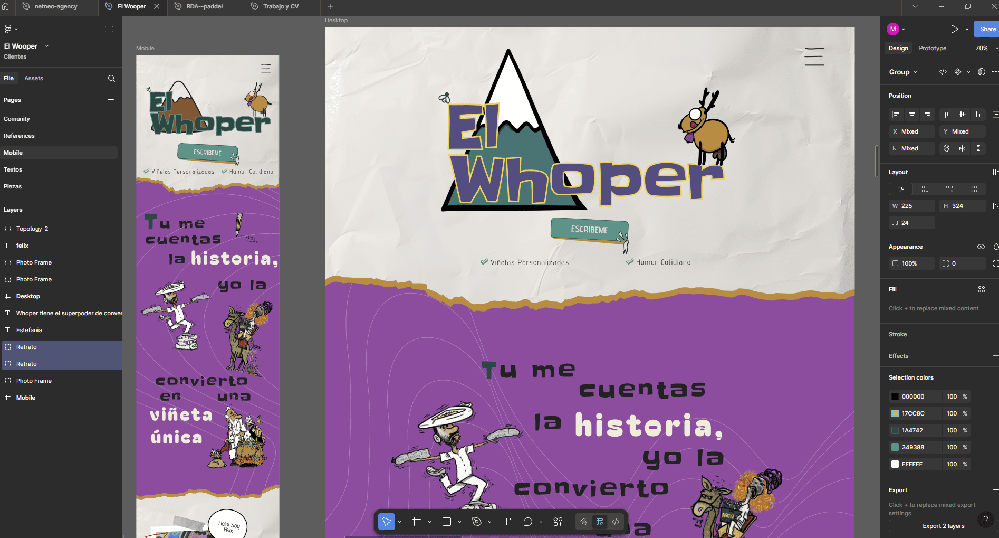
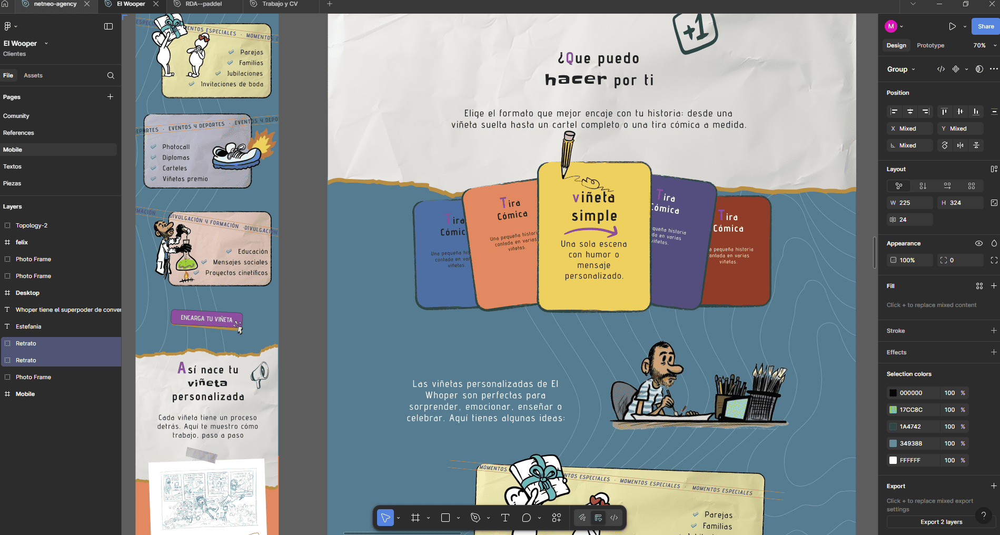

# 🎨 The Whoper (SPA)

  
  
  
  
  

---

## 📖 Project Overview

**Comic Designer Portfolio** is a **Single Page Application (SPA)** built
entirely with  
**React + TypeScript** using **Vite** for development and **CSS Modules** for
styling.  
It’s a **frontend-only project** designed to present the services of a comic
strip designer who offers **customized illustrations and panels for clients**.

The web is **component-based**, responsive, and features a **100% original
design** created in **Figma** and developed by **NetNeo**.

⚠️ **Note**: This project is **still in progress** and will continue to evolve.

---

## ✨ Features (Planned & Implemented)

- ⚡ Built with **Vite** for fast development.
- 🧩 Fully **component-based architecture** with TypeScript.
- 🎨 **CSS Modules** for clean, maintainable styles.
- 📱 **Responsive design** adaptable to all devices.
- 🖌️ **Original design** created with Figma.
- 🚀 **SPA navigation** with smooth transitions.
- 👨‍🎨 Dedicated to showcasing **comic strip design services**.

---

## 🎨 Preview (Design Mockups)

  
  

---

## 🌐 Live Demo

🔗 Coming soon...

---

## 🛠️ Technologies Used

- **React + TypeScript**
- **Vite**
- **CSS Modules**
- **Figma**

---
